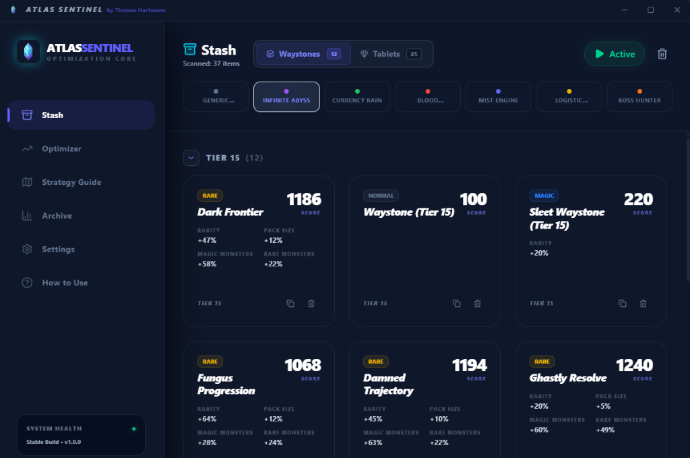
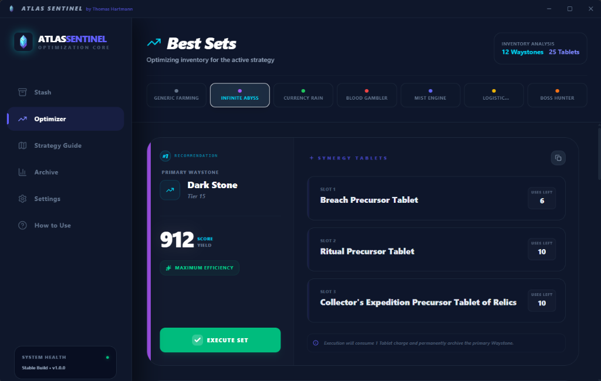
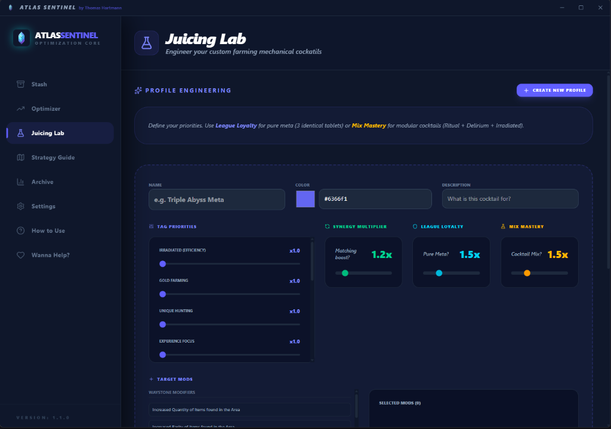
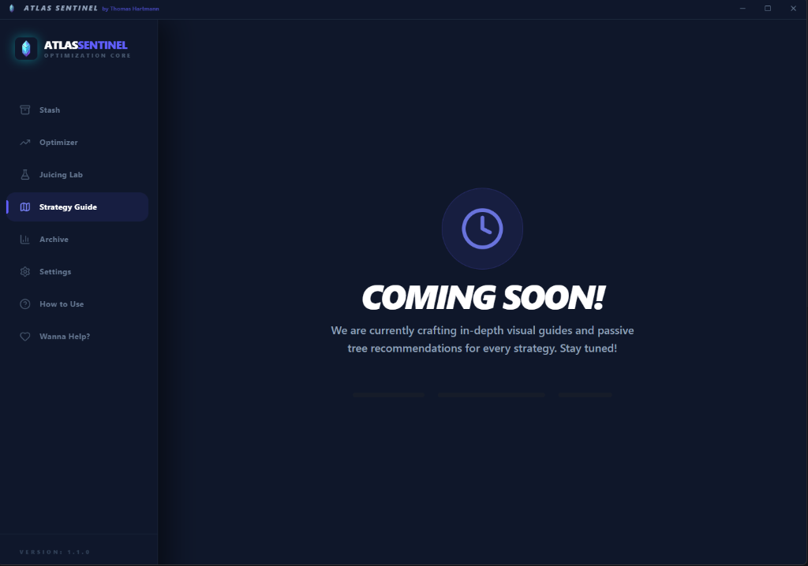
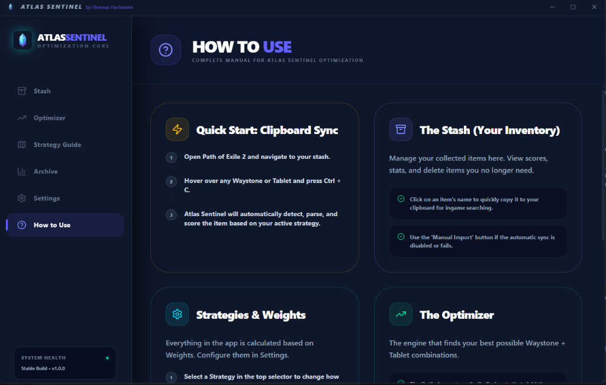

# Atlas Sentinel Poe2 🛰️
### The Ultimate PoE 2 Atlas Strategy Optimizer

[](https://creativecommons.org/licenses/by-nc/4.0/)
[](https://github.com/ThomasHartmannDev/Atlas-Sentinel-Poe2/releases)
[](https://pathofexile2.com)

**Atlas Sentinel Poe2** is a powerful desktop application designed to help Path of Exile 2 players maximize their endgame efficiency. It takes the guesswork out of Sentinel mapping by analyzing your desired rewards and suggesting the most efficient Sentinel combinations and Atlas configurations.

---

## 📥 Download & Installation

### Windows Installer (Direct Download)
The easiest way to get started is by downloading the latest installer from our Releases page:

> [!IMPORTANT]
> **[Click here to download the latest version from GitHub Releases](https://github.com/ThomasHartmannDev/Atlas-Sentinel-Poe2/releases)**

**How to use:**
1. Download the `Atlas Sentinel Setup 1.1.0.exe` file.
2. Run the installer and follow the on-screen instructions.
3. Launch **Atlas Sentinel Poe2** from your desktop or start menu.

### Portable Version
You can also find a portable `.zip` version (win-unpacked) in the releases if you prefer not to install the application.

---

## ✨ Key Features

## 💻 Development Setup

If you want to contribute or build from source, follow these steps:

### Prerequisites
- [Node.js](https://nodejs.org/) (LTS recommended)
- [npm](https://www.npmjs.com/)

### Steps
1. **Clone the repository**:
   ```bash
   git clone https://github.com/Hartman/atlas-sentinel.git
   cd atlas-sentinel
   ```

2. **Install dependencies**:
   ```bash
   npm install
   ```

3. **Run in development mode**:
   ```bash
   npm run dev
   ```

4. **Build for production**:
   ```bash
   npm run build
   ```
   The installer will be generated in the `release/` directory.

---

## 📁 Project Structure

```text
├── electron/         # Main process & IPC logic
├── src/
│   ├── components/   # UI Components (Optimizer, Analysis, etc.)
│   ├── store/        # Zustand state management
│   ├── types/        # TypeScript definitions
│   ├── lib/          # Utilities and logic
│   └── App.tsx       # Main UI entry point
├── public/           # Static assets (logos, icons)
└── package.json      # Dependencies and build scripts
```

---

## 📸 Screenshots

### Dashboard & Stash


### Strategy Optimizer


### Juicing Lab (Custom Profiles)


### Strategy Guide


### In-depth Guide


> [!TIP]
> Use the **Strategy Selector** in the sidebar to quickly switch between pre-configured farming metas!

---

## 📄 License

This project is licensed under the Creative Commons Attribution-NonCommercial 4.0 International (CC BY-NC 4.0) License - see the [LICENSE](LICENSE) file for details.

## 🤝 Contributing

Contributions are welcome! Please check the **"Wanna Help?"** tab inside the app for more details. 
You can:
- Report Bugs & Suggest Features via [GitHub Issues](https://github.com/ThomasHartmannDev/Atlas-Sentinel-Poe2/issues)
- Share ideas in [GitHub Discussions](https://github.com/ThomasHartmannDev/Atlas-Sentinel-Poe2/discussions)
- Submit Pull Requests for code improvements.

## ✉️ Contact

Project Maintainer: **Thomas Hartmann**

---
*Disclaimer: This is a fan-made tool and is not affiliated with Grinding Gear Games.*
